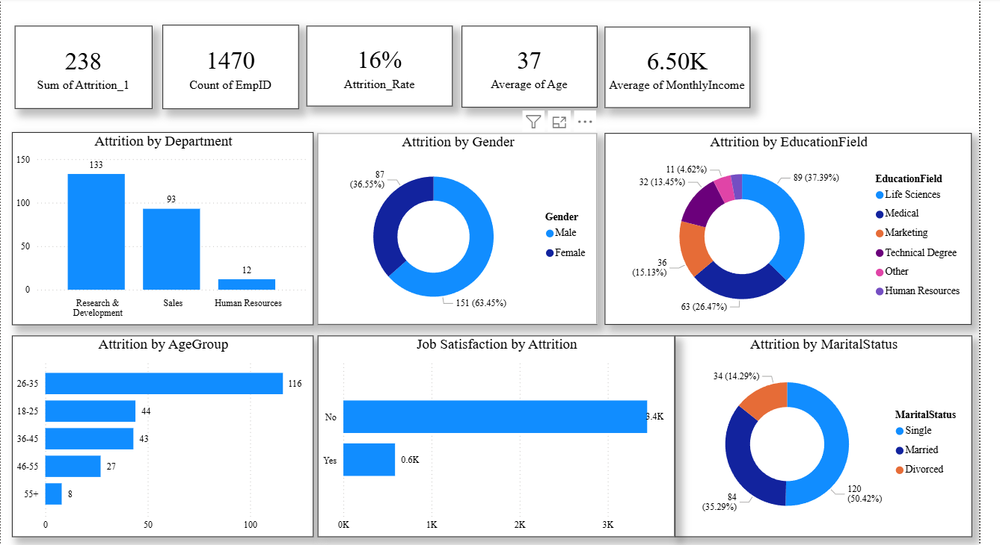

# 📊 HR Analytics Dashboard – Employee Attrition Analysis

## 📌 Overview

The **HR Analytics Dashboard** analyzes employee data to understand patterns behind **employee attrition**. The purpose of this project is to help HR teams identify the main reasons employees leave the organization and support **data-driven decision making** for improving employee retention.

This dashboard provides insights into employee attrition based on **department, gender, age group, education field, job satisfaction, and marital status**.

---

## 📷 Dashboard Preview

This dashboard visualizes employee attrition patterns across departments,
age groups, education fields, and job satisfaction levels.

---

## 📊 Key Metrics

* **Total Employees:** 1470
* **Total Attrition:** 238
* **Attrition Rate:** 16%
* **Average Age:** 37
* **Average Monthly Income:** 6.50K

---

## 📈 Insights from Dashboard

### Attrition by Department

* **Research & Development:** 133 employees
* **Sales:** 93 employees
* **Human Resources:** 12 employees

Research & Development has the highest employee attrition.

---

### Attrition by Gender

* **Male:** 151 (63.45%)
* **Female:** 87 (36.55%)

Male employees represent the majority of employees leaving the company.

---

### Attrition by Education Field

* **Life Sciences:** 37.39%
* **Medical:** 26.47%
* **Marketing:** 15.13%
* **Technical Degree:** 13.45%
* **Other:** 4.62%

Employees with Life Sciences and Medical backgrounds show the highest attrition.

---

### Attrition by Age Group

* **26–35 years:** 116 employees
* **18–25 years:** 44 employees
* **36–45 years:** 43 employees
* **46–55 years:** 27 employees
* **55+ years:** 8 employees

Employees aged **26–35** have the highest attrition rate.

---

### Job Satisfaction vs Attrition

Employees with **lower job satisfaction** are more likely to leave the organization.

---

### Attrition by Marital Status

* **Single:** 120 (50.42%)
* **Married:** 84 (35.29%)
* **Divorced:** 34 (14.29%)

Single employees have the highest attrition.

---

## 🛠 Tools Used

* **Power BI** – Dashboard creation and visualization
* **Excel / CSV** – Data source
* **Data Modeling** – KPI calculations

---

## 📂 Project Structure

HR-Analytics-Dashboard
│
├── Data
│   └── HR_Analytics .csv
│
├── Dashboard
│   └── HR_Analytics.pbix
│
├── images
│   └── HR_Analytics.png
│
└── README.md

---

## 🎯 Project Goals

* Understand employee attrition trends
* Identify departments with high turnover
* Analyze demographic factors affecting attrition
* Help HR teams make better retention strategies

---

## 🚀 Future Improvements

* Predict employee attrition using Machine Learning
* Add salary vs attrition analysis
* Analyze work-life balance impact
* Add more interactive filters and drill-down insights

---
